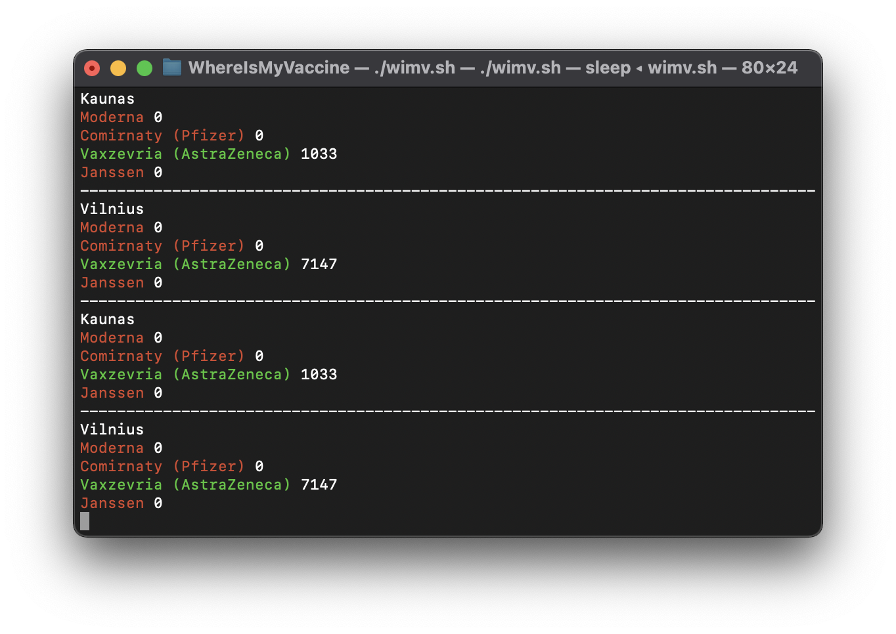

# WhereIsMyVaccine
This script logs the current availability of vaccine doses in the given cities and shouts when your desired vaccine(s) become(s) available!


## How to use
In a bash environment, run:
```bash
git clone https://github.com/Amirh0sseinHZ/WhereIsMyVaccine && ./WhereIsMyVaccine/wimv.sh
```
----
#### In order to configure the notification voice:
> We are dependent on [say](https://ss64.com/osx/say.html) for TTS.
  * Add your desired vaccines from the provided list to the `DesiredVaccines` array:
```bash
: '
The list of vaccines to choose from:
	- Moderna
	- Comirnaty (Pfizer)
	- Vaxzevria (AstraZeneca)
	- Janssen
'
DesiredVaccines=('Comirnaty (Pfizer)')
```
  * Add your desired cities from the provided list to the `DesiredCities` array:
```bash
: '
The list of cities to choose from:
	- Kaunas
	- Vilnius
'
DesiredCities=('Kaunas' 'Vilnius')
```
